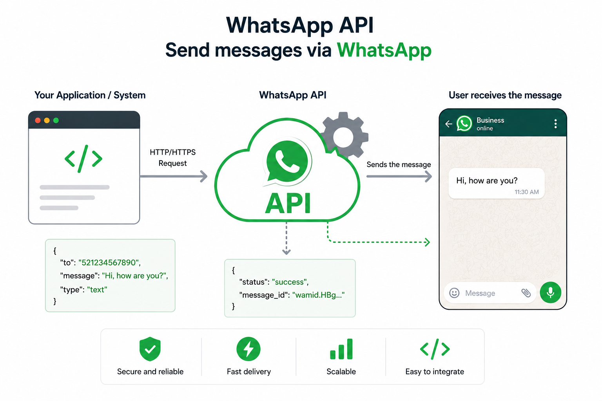

# WhatsApp Web API



A REST API for sending WhatsApp messages through WhatsApp Web using a queue system to avoid banning for mass sending.

## Features

- ✅ Message queue system with Redis
- ✅ Automatic on-demand processing (triggered when adding messages)
- ✅ Sequential sending to avoid WhatsApp limitations
- ✅ Lock to prevent multiple concurrent processing
- ✅ Message history storage by number
- ✅ Automatic cleanup of old messages (keeps 20 per number)
- ✅ Endpoints to query message status
- ✅ Error handling and retries

## Prerequisites

- Node.js v16 o superior
- Redis server
- npm o pnpm

## Installation

1. Clone the repository
2. Install dependencies:
   ```bash
   pnpm install
   ```
3. Configure environment variables (optional):
   ```bash
   cp .env.example .env
   ```
4. Start Redis server
5. Run the application:
   ```bash
   pnpm dev
   ```
## 🐳 Docker (Recommended)

The easiest way to run the full stack (app + Redis) with a single command.

### Prerequisites

- [Docker](https://docs.docker.com/get-docker/) and [Docker Compose](https://docs.docker.com/compose/install/) installed

### Quick Start

```bash
# 1. Clone and enter the project
git clone <repo-url> && cd whatsapp-web-api

# 2. Create your .env file (defaults work out of the box)
cp .env.example .env

# 3. Build and start all services
docker compose up -d

# 4. Check logs to confirm everything is running
docker compose logs app --tail=50
```

### First-Time WhatsApp Authentication (QR Code)

1. Open your browser at `http://localhost:6900/whatsapp-web/qr`
2. Scan the QR code with your WhatsApp mobile app
   - WhatsApp → Settings → Linked Devices → Link a Device
3. Once scanned, the session is **persisted** in a Docker volume — you won't need to scan again after restarts

### Useful Commands

```bash
# View app logs
docker compose logs -f app

# View Redis logs
docker compose logs -f redis

# Restart the app only
docker compose restart app

# Stop all services
docker compose down

# Stop and delete volumes (WARNING: loses WhatsApp session and Redis data)
docker compose down -v

# Rebuild the image after code changes
docker compose up -d --build

# Check service health
docker compose ps
```

### Architecture (Docker)

| Service | Container Name | Port | Volume |
|---------|---------------|------|--------|
| App | `whatsapp-web-api` | `6900` | `whatsapp_auth` (WhatsApp session), `whatsapp_cache` |
| Redis | `whatsapp-redis` | `6379` (internal only) | `redis_data` (queue & message persistence) |

- **Redis** runs on the internal Docker network — not exposed externally by default
- **WhatsApp session** is stored in `whatsapp_auth` volume, surviving container restarts and rebuilds
- **Healthchecks** ensure Redis is ready before the app starts, and the app reports its own health

### Troubleshooting (Docker)

**QR code not showing / blank page:**
```bash
docker compose restart app
```
Then revisit `http://localhost:6900/whatsapp-web/qr`.

**WhatsApp session lost after rebuild:**
Ensure the `whatsapp_auth` volume is not deleted. Use `docker compose down` (without `-v`).

**Chromium errors in logs:**
The image uses a Debian-based Chromium. If you see `aws` or sandbox errors, the `--no-sandbox` flag is already applied. Increase container memory if needed:
```yaml
# In docker-compose.yml under the app service:
deploy:
  resources:
    limits:
      memory: 1G
```

**Redis connection refused:**
The app waits for Redis to be healthy before starting. If you see persistent errors:
```bash
docker compose down
docker compose up -d
```

---
## API Endpoints

### WhatsApp Authentication

#### `GET /whatsapp-web/qr`
Gets the QR code to authenticate with WhatsApp Web.

**Successful response:**
- HTML with QR code to scan
- If already authenticated: text with associated number

---

### Message Sending

#### `POST /whatsapp-web/message`
Adds a message to the sending queue (does not send it immediately).

**Body:**
```json
{
  "phone": "3001234567",
  "message": "Hello, this is a test message",
  "countryPrefix": "57"
}
```

**Successful response:**
```json
{
  "message": "Message queued successfully",
  "success": true,
  "messageId": "3001234567_1695456789123_abc123xyz",
  "queuedAt": "2023-09-23T10:30:00.000Z"
}
```

---

### Message Queries

#### `GET /whatsapp-web/messages/report`
Gets a summary of all messages grouped by number.

**Successful response:**
```json
{
  "success": true,
  "report": {
    "573001234567": {
      "total": 15,
      "sent": 12,
      "pending": 3,
      "lastMessage": "2023-09-23T10:30:00.000Z"
    }
  },
  "totalPhones": 1
}
```

#### `GET /whatsapp-web/messages/:countryPrefix/:phone`
Gets all messages from a specific number.

**Example:** `GET /whatsapp-web/messages/57/3001234567`

**Successful response:**
```json
{
  "success": true,
  "phone": "573001234567",
  "messages": [
    {
      "phone": "3001234567",
      "countryPrefix": "57",
      "message": "Hello world",
      "sent": true,
      "created_at": "2023-09-23T10:30:00.000Z",
      "sent_at": "2023-09-23T10:32:00.000Z",
      "id": "3001234567_1695456789123_abc123xyz"
    }
  ],
  "total": 1,
  "sent": 1,
  "pending": 0
}
```

---

### Queue Control

#### `GET /whatsapp-web/queue/status`
Gets the current status of the queue processor.

**Successful response:**
```json
{
  "success": true,
  "isProcessing": false,
  "lastProcessed": "2023-09-23T10:32:00.000Z"
}
```

#### `GET /whatsapp-web/redis/status`
Checks the status of the Redis connection.

**Successful response:**
```json
{
  "success": true,
  "redis": {
    "connected": true,
    "host": "localhost",
    "port": 6379,
    "message": "Redis connected correctly"
  }
}
```

#### `POST /whatsapp-web/queue/process`
Forces manual processing of the queue and waits for it to finish.

**Successful response:**
```json
{
  "success": true,
  "message": "Queue processing completed",
  "processed": 3
}
```

---

## Queue System Operation

1. **Reception**: Messages are added to a Redis queue when they arrive via POST
2. **Automatic activation**: Adding a message automatically triggers processing
3. **Concurrency lock**: Only one processing can run at a time
4. **Sequential sending**: One message is sent every 2 seconds to avoid limitations
5. **Complete draining**: The processor continues until the queue is completely empty
6. **Persistence**: Messages are stored by number until 20 are exceeded
7. **Cleanup**: Old messages are automatically deleted by number

## Environment Variables

| Variable | Description | Default value |
|----------|-------------|---------------|
| `PORT` | Server port | `6900` |
| `REDIS_HOST` | Redis host | `localhost` |
| `REDIS_PORT` | Redis port | `6379` |
| `REDIS_PASSWORD` | Redis password | `null` |

## Data Structure

### Message in queue:
```javascript
{
  phone: "3001234567",
  countryPrefix: "57", 
  message: "Message text",
  sent: false,
  created_at: "2023-09-23T10:30:00.000Z",
  sent_at: null,
  id: "unique_message_id"
}
```

## Testing

1. Run the application: `pnpm dev`
2. Scan QR at: `http://localhost:6900/whatsapp-web/qr`
3. Send test message:
   ```bash
   curl -X POST http://localhost:6900/whatsapp-web/message \
     -H "Content-Type: application/json" \
     -d '{"phone":"3001234567","message":"Hello from the API","countryPrefix":"57"}'
   ```
4. Check status: `http://localhost:6900/whatsapp-web/messages/report`
